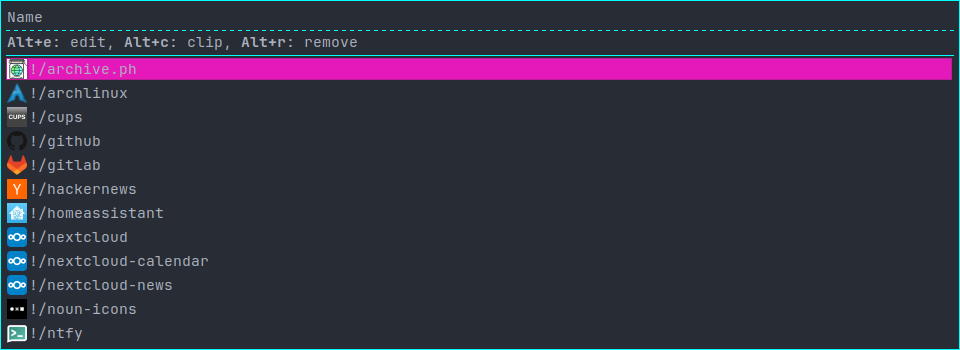

# Why?



While it might seem inherent that bookmarks of websites are stored in and accessed via your browser, I believe that web bookmarks should be stored and accessed independent of a browser.
This makes it possible to easily switch browsers or using multiple browsers simultaneously.
This bookmark manager is what I developed for my personal needs.
It is inspired by `pass`, [the standard unix password manager](https://www.passwordstore.org/).

The idea is that your bookmark collection is just a directory with optional subdirectories.
Every bookmark is just a file in this directory hierarchy.
This bookmark file consists of just the link of that bookmark.

This has the advantage of not needing any custom database or special file format.
Plus, you can just use git to track your bookmarks.
Also, a client can be written in one line of POSIX shell:
``` sh
xdg-open "$(cat "$(fzf)")"
```

The main interface I use to interact with my bookmark library is the rofi frontend.
It is rather hacky, but has favicon support.

## Features
- Rofi client with icon support. See image above.
- Base cli client that works like `pass`.
- Script to interactively add bookmarks (`rofi-bookmark-add`).
  Use this from your browser to add bookmarks.
- Theoretically there is also Android support via Termux, but these scripts currently reside in my dotfiles.
  In the future I might write an Android client for the format so that Termux is not needed anymore.

## Limitations/Problems
- Managing bookmarks as files has the problem of bad performance when enumerating all files/bookmarks for a call to, e.g., rofi.
  I play around that issue by precomputing the inputs to rofi.
  This is either way needed for icon support. 
- Since bookmark names are just filenames, we are limited by the filename characters that your kernel supports.
  On Linux you can of course not use slashes in the filename.
  That means you cannot have slashes in your bookmark names either.
  When you sync your bookmarks to Android this problem gets worse, since Android limits valid characters further because of the used file system.
  
Because of these two limitations I'm still not sure if this pass-inspired approach is the right one for a bookmark system, but version control support is a must for me and defining a custom file format for bookmarks seems tricky.

# Installation

``` sh
sudo make install
# if you want to use rofi with icons: 
pip install favicon
```

# Usage

Call `bookmark init` to init your bookmark dir.
It uses the directory `~/.bookmarks` by default.
I use `~/bookmarks` as my directory.
You can change that via the `BOOKMARKS_DIR` environment variable.
Then add some bookmarks, either with the rofi script or via the bookmark cli.
Then run `rofi-bookmark-download` to collect your bookmarks and download icons.
After running the download you can use `rofi-bookmark` rofi frontend.
Just bind that to some key in your hotkey daemon of choice.

For adding bookmarks from rofi, type in the the full path (including the filename) you want your bookmark to be stored in and press `Alt+e`.
This edits an existing or creates a new bookmark.
This part would need improvements, but I usually add bookmarks directly from my browser.
See the `rofi-bookmark-add` script for that.

I use a directory with the name `!` for important bookmarks.
Alphabetical sorting of rofi makes sure that bookmarks in this directory are shown first.

Optionally setup a cron job for downloading icons every 15 minutes.
That comes in handy when you sync your bookmarks between devices.

